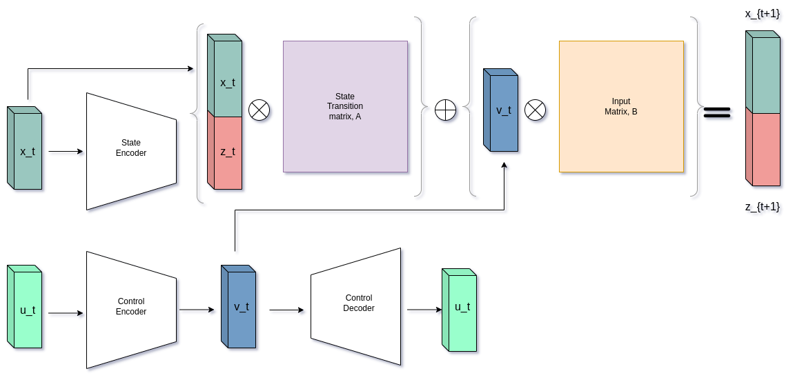

# Koopman Theory in Deep Learning for Linearizing Drone Dynamics

## Motivation

Drones are known for their agility and versatility in uses. That's why the number of startups emerging in drone space are increasing day-by-day, offering services in sectors ranging from agriculture to warehouse management. Although many upgrades are made to drone to handle these complex tasks, one bottleneck that always persist is non linear nature of drone systems which affects

On other side, data driven techniques such as Dynamic Mode Decomposition(DMD), which has it's roots in Koopman Theory, are becoming popular for their ablity to give out state-space equations of a system just from data as well as linearizing state-space of non-linear dynamics of system.

The idea is to use deep learning and Koopman Theory/DMD to linearize drone state-space thereby improving performance and stablity as well as applicable in real scenarios.

## Architecture

**Note: The encoders, decoders and matrices are trainable**

## Datasets

Datasets are generated from Flightmare Simulator and Acado Toolkit to get discrete time data as well as continuous time data.

**Code will be updated soon**

